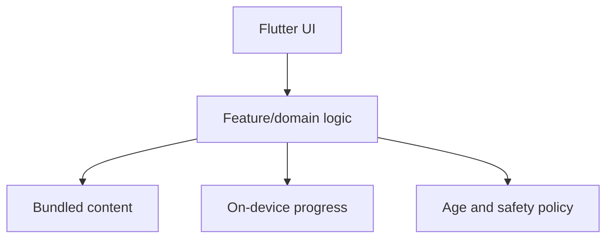

# Architecture

## Phase 1: local-first prototype

The first release is intentionally backend-free.

### Layers

- **Presentation:** Material 3 widgets, navigation, accessible motion and colour.
- **Domain:** quiz scoring, unlock rules, missions, age-band filtering.
- **Data:** bundled JSON/assets plus device storage in a later prototype increment.
- **Safety:** alias-only identity, age bands, parent gate, approved invite codes.

## Data boundaries

Allowed child-facing profile data:

- generated alias
- fictional avatar
- broad age band
- interests
- achievement/progress state
- parent-approved friend codes

Not allowed in the initial product:

- real name
- date of birth
- school
- phone or email
- exact location
- public profile or searchable handle
- unrestricted chat

## Evolution

A backend is considered only when cross-device sync or real friend collaboration is implemented. That decision requires threat modelling, parental consent, child-data retention rules, moderation design, encryption, regional compliance review, and deletion/export flows.
